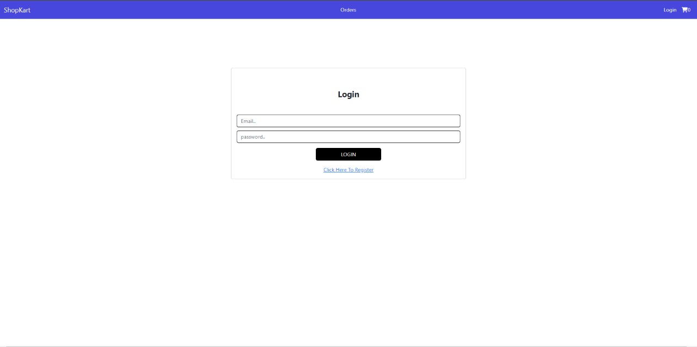
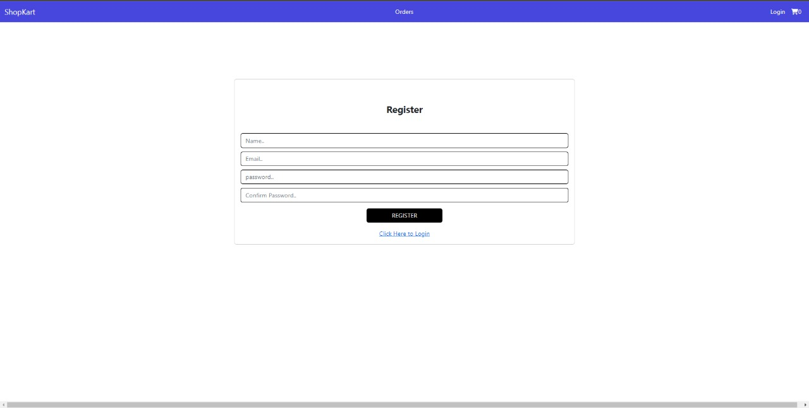
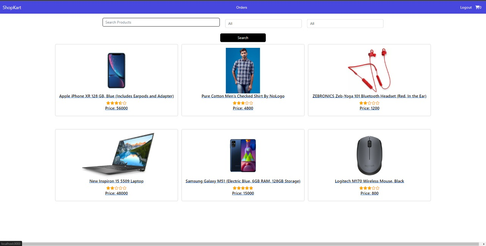
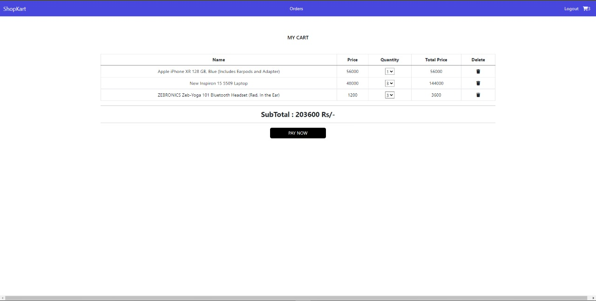

# Krypto_Submission
Final_Submission 
## Overview
- The entire project is provided in the following zip file [Ecommerce-app](https://1drv.ms/u/s!Ak1zweu8oWpxlxpfD-0BCoPY3NaR?e=arEWNj) along with Node modules.

## Video Description of my app
- I have also made a video description of my website - [YouTube](https://youtu.be/Mkx_4zF4AxY)

## What to do? (Problem Statement)
Our goal is to implement an eCommerce application.

## Application functionalities
1. A login page for the user , when a person login , he is redirected to home page.
2. A register page which is connected to mongo db database that accepts the registration details.
3. A home page that contains the product details
4. Filter option is provided in the home page to sort the elements according to price, type of items and searching of items from the page.
5. When we click on a particular product, product page opens with the description of product.
6. Add to cart button is provided on the individual products page.
7. Users can also give reviews about a product along with it's rating which is displayed on the app
8. Add to cart page is made where we can also make payment and payment confirmation can be seen on the console.
9. Pay now button is used for the payment.
10. Mongodb database saves all the output of our website

## Are there any improvements you could make to my submission?
I can add an admin panel in the project along with the payment confirmation in our stripe API which gives all the details of the payments made . I was trying to add the favourites button but due to some issues I had to remove it, I will definitely try to implement it again. The bootstrap part could have ben implemented more easily and the complexity of my website can be reduced. There are many files that have been created and those can be implemented in one single file.

## What would you do differently if you were allocated more time?
I can make my css and bootstrap more effective. In this version of my website , there are few areas where you can see that css is not that good , so I can definitely make it better if more time is allocated. There are many places in the app where some basic functionalities are yet to be added like adding the fully functional payment option. Login, Register , Home page can be made better with all the different types react components. I could have worked on making the user profile along with the orders page which shows my previous orders along with their details. Presently if I click on the orders navigation link on the webpage then it takes us to a blank page that just has navigation bar.

## How should the application work?

The user of this react application should be able to view all the products. The application should have the following workflow,

1. login/register functionality is created.
2. Once the user is authenticated
3. Users can add the products to the cart page and also add the payment details to buy the product.
4. Users can select the particular product and also add reviews related to the product along with the rating
5. Upon adding the details related to review the review is diplayed on the website itself.
6. Also user can filter the items in the product page.

## Development Setup
- Download the zip file provided above which is along with the modules used in my project
- Open the project in vs code.
- To run this project npm and node should be installed in the system first.
-  If we clone the project then we need to run the following commands to run the website
- `cd ecommerceProject`
- `npm i bootstrap`
- `npm i express`
- `npm i mongoose`
- `npm i nodemon`
- `npm i router`
- `npm i stripe`
- `npm i uuid`
- After this we go to the following directory
- `cd vit-assessment-1`
- We install the following dependencies here
- `npm i axios`
- `npm i bootstrap`
- `npm i jquery`
- `npm i @popperjs/core`
- `npm i reaact-dom`
- `npm i react-rating`
- `npm i react-redux`
- `npm i react-router-config`
- `npm i react-router-dom`
- `npm i react-scripts`
- `npm i react-stripe-checkout`
- `npm i redux`
- `npm i redux-devtools-extension`
- `npm i redux-thunk`
- `npm i web-vitals`
-  We split our terminal into two
- `cd vit-assessment-1`
- `npm start` - To start the website
-  On the other terminal
- `cd ecommerceProject`
- `nodemon server` - To run the backend part of the website

## To run the project extracted from zip file
-  We need to do the following'.
- `cd vit-assessment-1`
- `npm start`
- Parallelly in the other terminal run the following
- `cd ecommerceProject`
- `nodemon server` - To run the backend part of the website

## Images
### Login

### Register

### Home

### Single Product Page

### Cart

### Payment info

### Payment Details

### Payment Done

